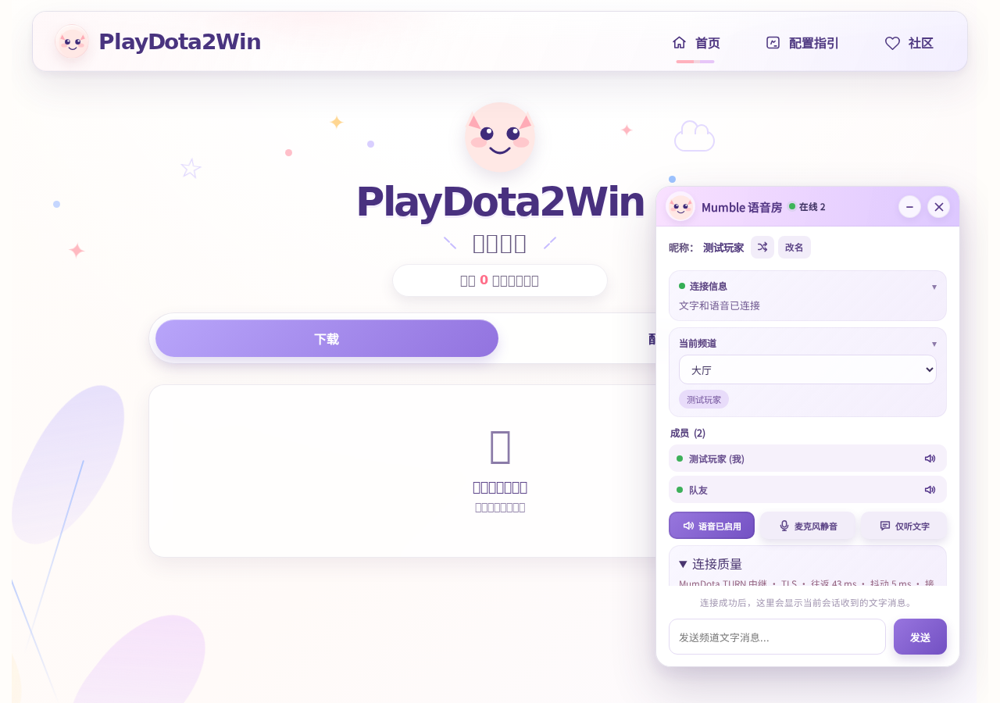
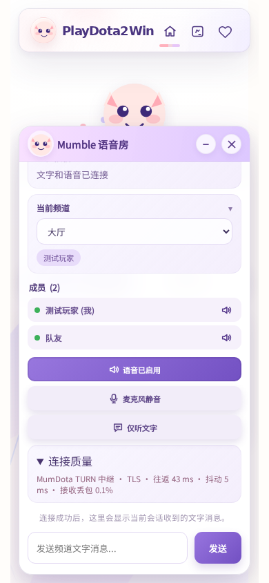

# MumDota TURN UI verification

The desktop (1280×900) and mobile (390×844) screenshots were captured in Chromium 149 using the production Vite build. API responses, WebSocket messages, peer connection state and quality statistics are fixtures for UI verification. The screenshots do not claim a live connection to the production TURN server. A local Noto Sans SC font was supplied because the test runtime lacks Chinese system fonts.

Verified: enabling voice, server-offer handling through the UI, expanding connection quality, no browser page errors, and the mobile panel/input staying within the visible panel after expanding diagnostics. Connection controls scroll independently so the header and text input remain accessible.

Actual TURN UDP/TCP/TLS allocations, session revocation, bidirectional WebRTC RTP, two speaker streams, renegotiation and ICE restart are covered separately by MumDota's Rust integration tests. Production NAT, DNS, certificates and end-to-end Mumble audio require the rollout acceptance checks in the deployment documentation.

