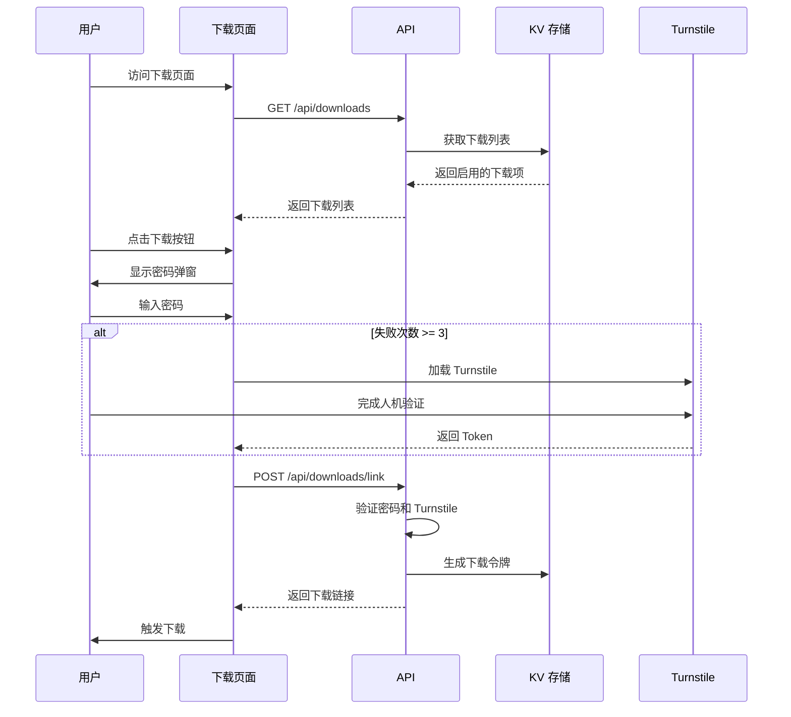
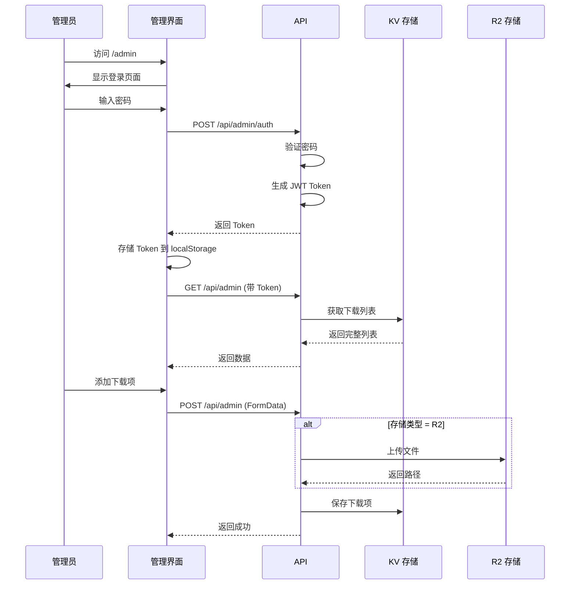

# PlayDota2Win 产品文档

## 📋 目录

1. [项目概述](#项目概述)
2. [核心功能](#核心功能)
3. [技术架构](#技术架构)
4. [用户流程](#用户流程)
5. [API 接口](#api-接口)
6. [数据模型](#数据模型)
7. [安全机制](#安全机制)
8. [部署说明](#部署说明)
9. [开发指南](#开发指南)

---

## 项目概述

**PlayDota2Win** 是一个基于 SvelteKit 5 和 Cloudflare Workers 构建的下载分发平台，专为游戏工具/软件分发设计。项目采用可爱的动漫风格 UI 设计，提供跨平台（Windows、macOS、Linux）的软件下载管理功能。

### 主要特点

- 🎨 **可爱动漫风格 UI** - 柔和的粉紫色渐变配色，丰富的动画效果
- 🔐 **多重安全防护** - 下载密码保护 + Cloudflare Turnstile 人机验证
- 📦 **多存储方式** - 支持外部链接、Cloudflare R2、自定义 S3 存储
- 🗂️ **分类管理** - 支持自定义分类（图标、颜色、描述）
- 📖 **配置指引** - 内置 Markdown 支持的配置指引系统
- ⚡ **边缘计算** - 基于 Cloudflare Workers 的全球分发
- 🎯 **管理后台** - 完整的管理界面，支持批量操作

---

## 核心功能

### 1. 公开下载页面 (`/` 或 `/download`)

#### 功能特性

- **多平台下载展示** - 自动识别并展示 Windows、macOS、Linux 版本
- **分类筛选** - 按分类浏览下载项（支持自定义图标和颜色）
- **下载保护**
  - 密码验证 - 用户需输入下载密码
  - Cloudflare Turnstile - 失败多次后自动触发人机验证
  - 短期令牌 - 生成 5 分钟有效期的下载令牌
- **配置指引**
  - 支持 Markdown 格式
  - 智能识别复制/打开动作
  - 弹窗展示详细指引
- **下载统计** - 实时显示总下载次数

#### UI 元素

- 可爱的吉祥物动画（悬停弹跳效果）
- 浮动星星和云朵背景装饰
- 渐变卡片设计
- 响应式布局

### 2. 管理后台 (`/admin`)

#### 认证系统

- 密码登录（JWT Token 认证）
- 失败次数保护（超过 3 次触发 Turnstile）
- Token 持久化（localStorage）

#### 分类管理

- **CRUD 操作** - 创建、编辑、删除分类
- **可视化编辑**
  - Emoji 图标选择器
  - 颜色选择器（预设颜色）
- **拖放排序** - 直观的拖放界面调整分类顺序
- **智能提示** - 删除分类时显示关联下载项数量

#### 下载项管理

- **添加下载项**
  - 平台选择（Windows/macOS/Linux）
  - 分类关联
  - 标题、描述、版本号、文件大小
  - 配置指引（支持多行文本）
  - 三种存储方式：
    - 外部链接 - 直接输入 URL
    - Cloudflare R2 - 自动上传到 R2 存储
    - 自定义 S3 - 使用预签名 URL 上传

- **批量操作**
  - 批量选择/全选
  - 批量移动到分类
  - 批量删除

- **下载项操作**
  - 启用/禁用切换
  - 编辑（通过 PUT 请求）
  - 删除（R2 文件自动清理）

#### 实时统计

- 总下载次数显示
- 下载项数量统计
- 分类下载项计数

---

## 技术架构

### 前端技术栈

```
SvelteKit 2 + Svelte 5
├── Svelte 5 Runes API ($state, $props, $effect)
├── TypeScript (严格模式)
├── Vite 7
└── 自定义组件
    ├── EmojiPicker - Emoji 选择器
    ├── ColorPicker - 颜色选择器
    └── DraggableList - 可拖放列表
```

### 后端架构

```
Cloudflare Workers
├── SvelteKit Adapter (adapter-cloudflare)
├── Cloudflare KV - 数据存储
│   ├── downloads_list - 下载列表
│   ├── categories_list - 分类列表
│   ├── admin_failure_count - 登录失败计数
│   └── download_token:{token} - 下载令牌
├── Cloudflare R2 - 文件存储
│   └── UPLOADS_BUCKET (downloads)
└── 环境变量
    ├── ADMIN_PASSWORD - 管理员密码
    ├── ADMIN_JWT_SECRET - JWT 签名密钥
    ├── ADMIN_SIGNING_SECRET - 下载路径签名密钥
    ├── DOWNLOAD_PASSWORD - 下载密码
    ├── TURNSTILE_SITE_KEY - Turnstile 站点密钥
    └── TURNSTILE_SECRET_KEY - Turnstile 服务端密钥
```

### 项目结构

```
playdota2win/
├── src/
│   ├── routes/
│   │   ├── +layout.svelte           # 根布局
│   │   ├── +page.svelte              # 首页（重定向到下载页）
│   │   ├── download/+page.svelte     # 公开下载页
│   │   ├── admin/+page.svelte        # 管理后台
│   │   └── api/
│   │       ├── downloads/
│   │       │   ├── +server.ts        # 公开下载列表
│   │       │   ├── auth/+server.ts   # 下载认证
│   │       │   ├── link/+server.ts   # 获取下载链接
│   │       │   └── relay/[...path]/+server.ts  # R2 文件中继
│   │       ├── admin/
│   │       │   ├── +server.ts        # 管理下载项
│   │       │   ├── auth/+server.ts   # 管理员认证
│   │       │   ├── categories/+server.ts  # 分类管理
│   │       │   └── download/[...path]/+server.ts  # 管理员下载
│   │       ├── categories/+server.ts # 公开分类列表
│   │       └── gettime/+server.ts    # 服务器时间
│   ├── lib/
│   │   ├── types.ts                  # TypeScript 类型定义
│   │   ├── auth.ts                   # 下载认证逻辑
│   │   ├── admin-auth.ts             # 管理员认证逻辑
│   │   ├── jwt.ts                    # JWT 工具函数
│   │   ├── turnstile.ts              # Turnstile 验证
│   │   └── components/
│   │       ├── EmojiPicker.svelte
│   │       ├── ColorPicker.svelte
│   │       └── DraggableList.svelte
│   └── worker-configuration.d.ts     # Cloudflare Worker 类型
├── wrangler.jsonc                    # Wrangler 配置
├── package.json
├── tsconfig.json
└── AGENTS.md                         # 开发指南
```

---

## 用户流程

### 公开用户下载流程



### 管理员操作流程



---

## API 接口

### 公开 API

#### 1. 获取下载列表

```http
GET /api/downloads
```

**响应示例**

```json
{
	"success": true,
	"data": {
		"items": [
			{
				"id": "uuid",
				"platform": "windows",
				"categoryId": "category-uuid",
				"title": "PlayDota2Win Windows 稳定版",
				"description": "适用于 Windows 10+",
				"configGuide": "# 配置步骤\n1. 下载后解压\n2. 运行 setup.exe",
				"filename": "PlayDota2Win.exe",
				"version": "v1.2.0",
				"size": "45MB",
				"storageType": "r2",
				"url": "/api/admin/download/windows/v1.2.0/PlayDota2Win.exe",
				"enabled": true,
				"createdAt": 1706000000000,
				"updatedAt": 1706000000000
			}
		],
		"downloadCount": 12580,
		"lastUpdated": 1706000000000
	}
}
```

#### 2. 获取分类列表

```http
GET /api/categories
```

**响应示例**

```json
{
	"success": true,
	"data": {
		"items": [
			{
				"id": "uuid",
				"name": "工具",
				"icon": "🔧",
				"color": "#667EEA",
				"description": "实用工具软件",
				"order": 0,
				"createdAt": 1706000000000,
				"updatedAt": 1706000000000
			}
		],
		"lastUpdated": 1706000000000
	}
}
```

#### 3. 验证下载

```http
POST /api/downloads/link
Content-Type: application/json

{
  "itemId": "uuid",
  "password": "下载密码",
  "turnstileToken": "可选的 Turnstile Token"
}
```

**成功响应**

```json
{
	"success": true,
	"data": {
		"url": "实际下载链接",
		"filename": "PlayDota2Win.exe",
		"count": 12581
	}
}
```

**失败响应（需要 Turnstile）**

```json
{
	"success": false,
	"error": "密码错误",
	"data": {
		"requireTurnstile": true,
		"siteKey": "0x4AAAAAAAA...",
		"failureCount": 3
	}
}
```

### 管理 API（需要 JWT 认证）

#### 1. 管理员登录

```http
POST /api/admin/auth
Content-Type: application/json

{
  "password": "管理员密码",
  "turnstileToken": "可选"
}
```

**成功响应**

```json
{
	"success": true,
	"data": {
		"token": "jwt-token"
	}
}
```

#### 2. 获取完整下载列表

```http
GET /api/admin
Authorization: Bearer {jwt-token}
```

#### 3. 添加下载项

```http
POST /api/admin
Authorization: Bearer {jwt-token}
Content-Type: multipart/form-data

platform: windows
title: 标题
description: 描述
configGuide: 配置指引
filename: 文件名
version: v1.0.0
size: 45MB
storageType: r2
categoryId: uuid (可选)
file: [文件数据] (r2/s3 需要)
url: https://... (link 需要)
s3Config: {...} (s3 需要)
```

#### 4. 更新下载项

```http
PUT /api/admin
Authorization: Bearer {jwt-token}
Content-Type: application/json

{
  "id": "uuid",
  "enabled": true,
  "categoryId": "新分类ID"
}
```

#### 5. 删除下载项

```http
DELETE /api/admin
Authorization: Bearer {jwt-token}
Content-Type: application/json

{
  "id": "uuid"
}
```

#### 6. 分类管理

```http
# 获取分类
GET /api/admin/categories
Authorization: Bearer {jwt-token}

# 创建分类
POST /api/admin/categories
Authorization: Bearer {jwt-token}
Content-Type: application/json
{
  "name": "工具",
  "icon": "🔧",
  "color": "#667EEA",
  "description": "描述",
  "order": 0
}

# 更新分类
PUT /api/admin/categories
Authorization: Bearer {jwt-token}
Content-Type: application/json
{
  "id": "uuid",
  "name": "新名称",
  ...
}

# 删除分类
DELETE /api/admin/categories
Authorization: Bearer {jwt-token}
Content-Type: application/json
{
  "id": "uuid"
}
```

---

## 数据模型

### DownloadItem (下载项)

```typescript
interface DownloadItem {
	id: string; // UUID
	platform: Platform; // 'windows' | 'macos' | 'linux'
	categoryId?: string; // 分类 ID（可选）
	title?: string; // 标题（用于展示）
	description?: string; // 描述
	configGuide?: string; // 配置指引（Markdown）
	filename?: string; // 文件名
	version: string; // 版本号（如 v1.2.0）
	size: string; // 文件大小（如 45MB）
	storageType: StorageType; // 'link' | 'r2' | 's3'
	url: string; // 存储 URL 或路径
	signedUrl?: string; // 短期签名链接（仅展示，不持久化）
	s3Config?: S3Config; // S3 配置（仅 s3 类型）
	createdAt: number; // 创建时间戳
	updatedAt: number; // 更新时间戳
	enabled: boolean; // 是否启用
}
```

### Category (分类)

```typescript
interface Category {
	id: string; // UUID
	name: string; // 分类名称
	icon?: string; // 图标（emoji 或 SVG）
	color?: string; // 颜色（十六进制）
	description?: string; // 描述
	order: number; // 排序顺序
	createdAt: number; // 创建时间戳
	updatedAt: number; // 更新时间戳
}
```

### S3Config (S3 配置)

```typescript
interface S3Config {
	endpoint?: string; // S3 Endpoint
	bucket?: string; // Bucket 名称
	region?: string; // 区域
	presignedUrl?: string; // 预签名上传 URL
	publicUrl?: string; // 公开下载 URL
}
```

### KV 存储结构

```typescript
// KV 键值对
{
  "downloads_list": DownloadList,
  "categories_list": CategoryList,
  "admin_failure_count": number,
  "download_failure_count": number,
  "download_token:{token}": {
    itemId: string,
    createdAt: number
  }
}
```

---

## 安全机制

### 1. 下载保护

#### 密码验证

- 环境变量 `DOWNLOAD_PASSWORD` 配置统一下载密码
- 失败次数记录在 KV（`download_failure_count`）
- 失败 3 次后强制启用 Turnstile

#### Cloudflare Turnstile

- 自动在失败多次后加载
- 服务端验证 Token 真实性
- 验证成功后重置失败计数

#### 短期令牌

- 验证成功后生成唯一令牌（UUID）
- 存储在 KV，有效期 5 分钟
- 令牌只能使用一次
- 防止链接被滥用

### 2. 管理员认证

#### JWT Token

- 密码验证成功后签发 JWT
- Token 包含过期时间（7 天）
- 使用 `ADMIN_JWT_SECRET` 签名
- 所有管理 API 需要验证 Token

#### 失败保护

- 失败次数记录在 KV（`admin_failure_count`）
- 失败 3 次后强制启用 Turnstile
- 成功登录后重置计数

### 3. 文件访问控制

#### R2 文件中继

- 管理员访问：通过签名验证（`ADMIN_SIGNING_SECRET`）
- 公开下载：通过令牌验证
- 路径安全：拒绝包含 `..`、`/`、`\` 的路径

#### 签名机制

```typescript
// 生成签名路径
const signedUrl = await signDownloadPath('/api/admin/download/path', secret);
// 格式：/api/admin/download/path?expires=timestamp&signature=hash
```

### 4. 输入验证

- 所有用户输入经过验证
- FormData 类型检查
- JSON 解析错误处理
- 文件类型和大小限制（客户端）

---

## 部署说明

### 环境变量配置

在 Cloudflare Workers 控制台或 `.dev.vars` 文件中配置：

```bash
# 管理员认证
ADMIN_PASSWORD=你的管理员密码
ADMIN_JWT_SECRET=随机生成的JWT密钥
ADMIN_SIGNING_SECRET=随机生成的签名密钥

# 下载认证
DOWNLOAD_PASSWORD=你的下载密码

# Cloudflare Turnstile（可选）
TURNSTILE_SITE_KEY=你的站点密钥
TURNSTILE_SECRET_KEY=你的服务端密钥
```

### Wrangler 配置

`wrangler.jsonc` 已配置：

- KV Namespace: `APP_KV`
- R2 Bucket: `UPLOADS_BUCKET` (downloads)
- Custom Domain: `playdota2.win`

### 部署步骤

1. **安装依赖**

   ```bash
   npm install
   ```

2. **本地开发**

   ```bash
   npm run dev
   ```

3. **类型检查**

   ```bash
   npm run check
   ```

4. **构建**

   ```bash
   npm run build
   ```

5. **部署到 Cloudflare**
   ```bash
   npm run deploy
   ```

### KV 和 R2 设置

1. 在 Cloudflare 控制台创建：
   - KV Namespace（名称：APP_KV）
   - R2 Bucket（名称：downloads）

2. 更新 `wrangler.jsonc` 中的 ID：
   ```jsonc
   "kv_namespaces": [
     {
       "binding": "APP_KV",
       "id": "你的KV_ID"
     }
   ],
   "r2_buckets": [
     {
       "binding": "UPLOADS_BUCKET",
       "bucket_name": "downloads"
     }
   ]
   ```

---

## 开发指南

### 技术约定

#### Svelte 5 语法

- 使用 `$state()` 定义响应式状态
- 使用 `$props()` 接收组件属性
- 使用 `{@render children()}` 渲染插槽
- 事件处理：`onclick={handler}`（不是 `on:click`）

#### TypeScript

- 严格模式开启
- 优先使用显式类型注解
- API 响应使用 `satisfies ApiResponse<T>`

#### 代码风格

- 缩进：Tabs
- 格式化：`npm run format`（Prettier）
- 检查：`npm run lint`（ESLint）

### 常用命令

```bash
# 开发服务器
npm run dev

# 类型检查
npm run check
npm run check:watch

# 代码检查
npm run lint

# 代码格式化
npm run format

# 构建
npm run build

# 本地预览（Workers）
npm run preview

# 部署
npm run deploy

# 生成 Cloudflare 类型
npm run cf-typegen
```

### 添加新功能

1. **添加新的下载存储类型**
   - 更新 `src/lib/types.ts` 中的 `StorageType`
   - 在 `src/routes/api/admin/+server.ts` 添加上传逻辑
   - 在管理界面添加配置表单

2. **添加新的 API 端点**
   - 在 `src/routes/api/` 下创建 `+server.ts`
   - 导出 `GET`、`POST` 等 RequestHandler
   - 使用 `json()` 返回符合 `ApiResponse` 格式的响应

3. **添加新组件**
   - 在 `src/lib/components/` 下创建 `.svelte` 文件
   - 使用 Svelte 5 语法
   - 导出 props 类型

### 调试技巧

1. **查看 KV 数据**

   ```bash
   wrangler kv:key get --binding=APP_KV "downloads_list"
   ```

2. **查看 R2 文件**

   ```bash
   wrangler r2 object get downloads/path/to/file
   ```

3. **本地开发环境**
   - KV 和 R2 在 dev 模式下不可用
   - API 会返回默认数据
   - 使用 `platform?.env` 检查环境

---

## UI 设计规范

### 配色方案

- **主色调**
  - 紫色：`#6B4C9A`
  - 粉色：`#FF6B9D`
  - 渐变：`linear-gradient(135deg, #667eea 0%, #764ba2 100%)`

- **背景**
  - 页面背景：`linear-gradient(135deg, #fff5f7 0%, #f0e6ff 50%, #e6f0ff 100%)`
  - 卡片背景：`rgba(255, 255, 255, 0.85)` + `backdrop-filter: blur(10px)`

- **文字**
  - 标题：`#6B4C9A`
  - 正文：`#4D3A73`
  - 次要文字：`#8B7BA8`
  - 提示文字：`#A89BC4`

### 字体

- **标题**：`Fredoka`（Google Fonts）
- **正文**：`Nunito`（Google Fonts）
- **中文回退**：`PingFang SC`, `Microsoft YaHei`

### 组件样式

- **按钮**
  - 圆角：`border-radius: 12-20px`
  - 悬停：`translateY(-2px)` + 阴影增强
  - 渐变背景（主要按钮）

- **卡片**
  - 圆角：`border-radius: 16-20px`
  - 半透明白色背景
  - 模糊效果（`backdrop-filter`）
  - 阴影：`box-shadow: 0 8px 25px rgba(107, 76, 154, 0.12)`

- **动画**
  - 浮动星星：`animation: float 6s ease-in-out infinite`
  - 飘动云朵：`animation: drift 20s linear infinite`
  - 按钮弹跳：悬停时触发

---

## 常见问题

### Q: 如何更改下载密码？

A: 在 Cloudflare Workers 环境变量中修改 `DOWNLOAD_PASSWORD`。

### Q: 如何重置管理员密码？

A: 在 Cloudflare Workers 环境变量中修改 `ADMIN_PASSWORD`，用户需要重新登录。

### Q: R2 文件无法下载？

A: 检查：

1. R2 Bucket 名称是否正确（`downloads`）
2. Wrangler 配置中的 binding 是否正确
3. 签名密钥是否配置（`ADMIN_SIGNING_SECRET`）

### Q: Turnstile 不显示？

A: 检查：

1. `TURNSTILE_SITE_KEY` 和 `TURNSTILE_SECRET_KEY` 是否配置
2. 站点密钥是否对应当前域名
3. 浏览器是否阻止了第三方脚本

### Q: 如何迁移数据？

A: 使用 Wrangler 导出/导入 KV 数据：

```bash
# 导出
wrangler kv:key get --binding=APP_KV "downloads_list" > downloads.json

# 导入
wrangler kv:key put --binding=APP_KV "downloads_list" --path=downloads.json
```

---

## 版本历史

### v1.0.0 (当前版本)

- ✅ 基础下载功能
- ✅ 管理后台
- ✅ 分类系统
- ✅ 多存储支持（Link、R2、S3）
- ✅ Turnstile 集成
- ✅ 配置指引系统
- ✅ 批量操作
- ✅ 拖放排序

---

## 联系与支持

- **域名**: playdota2.win
- **技术栈**: SvelteKit 5 + Cloudflare Workers
- **部署平台**: Cloudflare Workers

---

**生成时间**: 2026-01-24  
**文档版本**: 1.0.0
